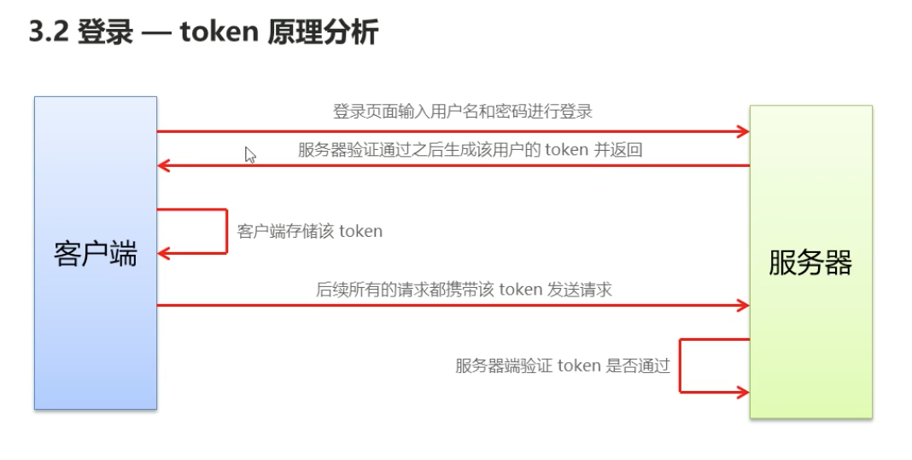
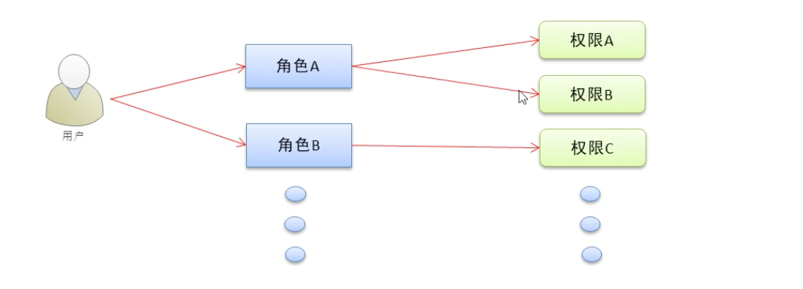

# Vue+elementui商城管理实战

### 项目前准备

#### 划分功能模块


### 项目开始

#### 新建一个项目

**使用vue-cli3**

`vue create 项目名`

**配置路径别名**

1. 新建vue.config.js

2. 写入配置信息

   ```js
   const path = require('path'); //引入path模块
   function resolve(dir) {
     return path.join(__dirname, dir); //path.join(__dirname)设置绝对路径
   }
   
   
   module.exports = {
   
     chainWebpack: (config) => {
       config.resolve.alias
         //set第一个参数：设置的别名，第二个参数：设置的路径
         .set('@', resolve('./src'))
         .set('components', resolve('./src/components'))
         .set('assets', resolve('./src/assets'))
         .set('views', resolve('./src/views'))
         .set('network', resolve('./src/network'));
       //注意 store 和 router 没必要配置
     }
   };
   ```

3. 启用别名配置后，vscode路径提示，[戳这里文章](https://www.jianshu.com/p/1798d57ecdab)

**引入`normalize.css`,**

在App.vue的style中使用`@import url("assets/css/base.css");`

**安装vue-router**

1. `npm install vue-router -s -d`

2. 新建router文件夹

   ```js
   import Vue from 'vue';
   import VueRouter from 'vue-router';
   
   const HellWorld = () => import('components/HelloWorld.vue');
   
   
   Vue.use(VueRouter);
   
   const routes = [{
     path: '',
     redirect: '/home'
   }, {
     path: "/home",
     component: HellWorld
   }];
   
   
   export default new VueRouter({
     routes
   });
   ```

3. 在main.js中引入

   ```js
   import router from './route/index';
   new Vue({
     router,
     render: h => h(App),
   }).$mount('#app');
   ```

**安装axios**

1. `npm install axios -s`

2. 封装api请求,

   新建network文件夹

   新建request.js

   ```js
   import axios from 'axios';
   
   export function request(config) {
     const instance = axios.create({
       baseUrl: '...',
       timeout: 5000
     });
   
     // 拦截发送请求
     
     instance.interceptors.request.use(config => {
       // 每个请求都发送token
      config.headers.Authorization = 		window.sessionStorage.getItem("token");
       return config;
     }, err => {
       console.log('发送请求失败' + err);
     });
   
     // 拦截响应
     instance.interceptors.response.use(res => {
       return res.data;
     }, err => {
       console.log("响应失败" + err);
     });
   
     return instance(config);
   }
   ```
   
3. 使用

   ```js
   export function toLogin(username, password) {
     return request({
       url: '/login',
       method: 'GET',
       params: {
         username,
         password
       }
     });
   }
   ```

**引入elementUI**

1. 引入`vue add element`

   + How do you want to import Element? -->选择 `Import on demand` （关键）
   + Choose the locale you want to load–>选择 `zh-CN`

2. 使用

   1. 在plugins.js中引入需要的组件
2.  在需要使用的地方使用`      <el-button>el-button</el-button>`
  

**使用sass**

1. ` npm install sass-loader --save-dev`

2. `npm install node-sass --save-dev`

3. 使用

   ```css
   <style lang="scss" scoped>
   .login {
     background-color: blue;
     h1 {
       color: hsl(0, 0%, 95%);
     }
   }
   </style>
   ```

   

#### 登录模块

**登录逻辑图**



**git新建login分支**

`git checkout -b login`新建登录子分支

`git branch` 查看分支情况

**新建登录页面,并配置登录路由**

1. 新建登录页面

   注意点

   1. 使用elementui表单时，`<el-input v-model=".." ></el-input>`,要是用`v-model`而不是使用`:model`

   2. 使用sessionStorage来储存token

      `window.sessionStorage.setItem('token',data.token);`

   3. 代码跳转并携带参数

      ```js
      // 路由跳转
      this.$router.push({
        path:"/home",
        query:{
        data,
        username:111
        }
      })
      ```

   4. 在前置路由守卫配置，如果没有token则跳转到登录页面

      ```js
      router.beforeEach((to,from,next) => {
          // 判断请求路径是否是login
          if(to.path == "/login"){
            next();
          }else{
            // 查看有没有token,如果有则跳转继续跳转，如果没有则跳转到login
            window.sessionStorage.getItem("token") != null ? next() : next('/login');
          }
      });
      ```

   5. 监听路由变化，用于提示用户还未登录

      ```js
       watch: {
          $route: {
            handler: function(val){
              val.query.status && this.$message({message: '请先登录',
                  type: 'warning'});
            },
          } 
        },
      ```

2. 配置路由

   ```js
   const Login = () => import('../views/login/Login.vue');
   const routes = [{
     path: '/',//访问根目录时跳转到登录页面
     redirect: '/login'
   }, {
     path: "/home",
     component: HelloWorld
   }, {
     path: '/login',
     component: Login
   }];
   ```

3. 合并分支并提交代码

   1. `git add .`
   2. `git commit -m "完成登录模块"`
   3. `git checkout master ` 切换为主分支
   4. `git merge login` 合并login分支
   5. `git push origin master` 推送到云端

#### 主页

1. 侧边栏
   + 需要注意将menu的样式设为`border-right:none`


#### 用户列表

+ 使用el-table注意事项

  ```js
  <el-table :data="userListData" border style="width: 100%">
            <el-table-column type="index"></el-table-column>
            <el-table-column prop="username" label="姓名"></el-table-column>
            <el-table-column prop="email" label="邮箱"></el-table-column>
            <el-table-column prop="mobile" label="电话号码"></el-table-column>
            <el-table-column prop="role_name" label="角色"></el-table-column>
            <el-table-column prop="mg_state" label="状态">
              <template slot-scope="scope">
                <el-switch v-model="scope.row.mg_state" active-color="#13ce66" inactive-color="#ccc"></el-switch>
              </template>
            </el-table-column>
            <el-table-column label="操作"></el-table-column>
          </el-table>
  ```

  渲染模板使用作用域插槽来获取当行的数据

  ```js
  <template slot-scope="scope">
                <el-switch v-model="scope.row.mg_state" active-color="#13ce66" inactive-color="#ccc"></el-switch>
  </template>
  ```

+ 当Dialog为子组件时，由父组件触发Dialog，子组件的visible要这样写

  ```vue
  // 父组件
  <add-dialog :dialogVisible.sync="addDialogVisible" />
  
  // 子组件
  // 这里的compDialogVisible需要注意
  <el-dialog title="添加用户" :visible.sync="compDialogVisible" width="30%">
        <div>这是一段信息</div>
        <span slot="footer" class="dialog-footer">
          <el-button @click="dialogClose ">取 消</el-button>
          <el-button type="primary" @click="dialogClose">确 定</el-button>
        </span>
  </el-dialog>
  computed: {
      compDialogVisible: {
        get() {
          return this.dialogVisible;
        },
        set() {
          this.dialogClose();
        }
      }
  },
  methods: {
      dialogClose() {
        this.$emit("update:dialogVisible", false);
      }
  },
  ```

+ .sync用法

  一个组件上只能定义一个v-model，如果其他prop也要实现双向绑定的效果该怎么办呢？ 简单的方法是子组件向父组件发送一个事件，父组件监听该事件，然后更新prop。具体如下：

  ```vue
  // info.vue组件定义了一个value 属性， 和一个valueChanged事件
  <template>
      <div>
          <input @input="onInput" :value="value"/>
      </div>
  </template>
  
  <script>
  export default {
      props: {
          value: {
              type: String
          }
      },
      methods: {
          onInput(e) {
              this.$emit("valueChanged", e.target.value)
          }
      }
  }
  </script>
  ```

  父组件index.vue

  ```vue
  <template>
      <info :value="myValue" @valueChanged="e => myValue = e"></info>
  </template>
  
  <script>
      inport info from './info.vue';
      export default {
          components: {
              info,
          },
          data() {
              return {
                  myValue: 1234,
              }
          },
      }
  </script>
  ```

  上述写法太麻烦了，通过.sync可以简化上面代码，只需要修两个地方：

  1. 组件内触发的事件名称以“update:myPropName”命名，相应的上述info组件改为 update:value
  2. 父组件v-bind:value 加上.sync修饰符，即 v-bind:value.sync
     这样父组件就不用再手动绑定@update:value事件了。

  #### 用法1: v-bind:prop.sync="propvalue"

  ```vue
  // info.vue组件
  ...
  methods: {
      onInput(e) {
          this.$emit("update:value", e.target.value)
      }
  }
  // index.vue组件
  <info :value.sync="myValue"></info>
  ```

+ 添加用户时,axios的参数要使用data,params参数会在urlquery上,

  ```js
  export function addUser(userInfo) {
  
    return request({
      method: "POST",
      url: '/users',
      // 这里不是params
      data: userInfo
    });
  }
  ```

+ el 表单自定义验证规则

  ```js
  data(){
  	let checkEmail = (rule, value, callback) => {
        // eslint-disable-next-line no-useless-escape
        let myreg = /^([a-zA-Z0-9]+[_|\_|\.]?)*[a-zA-Z0-9]+@([a-zA-Z0-9]+[_|\_|\.]?)*[a-zA-Z0-9]+\.[a-zA-Z]{2,3}$/;
        if (myreg.test(value)) {
          callback();
        } else {
          callback(new Error("输入邮箱不符合规则"));
        }
      };
    return {
      userRules:{
        email: [
            { required: true, message: "请输入邮箱", trigger: "blur" },
            { validator: checkEmail, trigger: "blur" }
          ],
      }
    }
  }
  
  ```

  

+ 搜索逻辑

  搜索接口参数

  ```js
   queryInfo: {
     // 搜索参数
     query: "",
     // 当前页面
     pagenum: 1,
     // 一页显示多少条
     pagesize: 5
  },
  ```

  页面代码

  ```vue
   <el-input
             placeholder="输入搜索内容"
             @clear="getUserListInfoUser" <!--清除内容时重新请求数据，展示所有数据-->
             v-model="queryInfo.query" <!--搜索框绑定请求参数-->
             clearable
             >
     <el-button slot="append" @click="search" icon="el-icon-search"></el-button>
  </el-input>
  ```

  搜索按钮

  ```js
   // 重置pagenum为1
   this.queryInfo.pagenum = 1;
   this.getUserListInfoUser();
  ```


#### 权限页

1. 用户-角色-权限图

   > 用户对应角色，拥有这个角色就拥有角色下的权限

   

2. 权限列表等级展示

   v-if与v-show比较，如果元素切换频率频繁则使用v-show，否则使用v-if

3. 角色页

   使用computed传参数时应使用闭包

   当v-for与v-if需要同时使用时，应使用computed过滤掉不需要的子项

   ```js
     computed: {
       haveRightChildren() {
         return function(rightsChildren) {
           rightsChildren = rightsChildren.filter(
             item => item.children.length !== 0
           );
           return rightsChildren;
         };
       }
     },
   ```

   ```js
   v-for="item in haveRightChildren(scope.row.children) "
   ```

4. 使用tree组件默认选中已分配的权限，使用递归向数组push已勾选的id值，**数据修改，但视图未发生改变**

   ```vue
       <el-tree
         :data="rightsTreeData"
         show-checkbox
         :props="defaultProps"
         default-expand-all
         node-key="id"
         ref="treeRightsRef"
         :default-checked-keys="checkedKeys"
       />
   //:default-checked-keys是默认选中的id数组
   ```

   ```js
   		//对话框打开时，获取已选中的id值赋值给checkedKeys,但是不知道为什么要这么做才能响应
   		//而this.getCheckedKeys(this.currentRole, this.checkedKeys);这样没有响应
   		dialogOpen() {
         // TODO:为什么要这样赋值才有响应
         let arr = [];
         this.getCheckedKeys(this.currentRole, arr);
         this.checkedKeys = arr;
       },
   	// 获取已经选中的权限
       getCheckedKeys(node, arr) {
         if (!node.children) {
           return arr.push(node.id);
         }
   
         node.children.forEach(item => {
           this.getCheckedKeys(item, arr);
         });
       },
   ```


### 商品

#### 商品分类

elementui的树形表格属性expand-row-keys为数组，里面为需要展开的key值**为字符串**

```vue
<el-table
          v-loading="isLoading"
          :data="categoriesData"
          style="width: 100%;margin-bottom: 20px;"
          row-key="cat_id"
          border
          :indent="20"
          expand-row-keys="['70']" <!--默认展开key值为70的那一行，虽然cat_id为数字，但是这里还是要写为字符串-->
          :tree-props="{children: 'children'}"
    			>
```

elementui树形表格全部展开或收缩

```js
		// 全部收缩
    shrinkAll() {
      this.forArr(this.categoriesData, false);
    },
    expandAll() {
 			 this.forArr(this.tableData, true)
		},
    // 全部展开或全部收缩
    forArr(arr, isExpand) {
      arr.forEach(i => {
        this.$refs.theTable.toggleRowExpansion(i, isExpand);
        if (i.children) {
          this.forArr(i.children, isExpand);
        }
      });
    }
```

elementui级联选择器高度过高，添加全局样式

```css
.el-cascader-menu {
  height: 300px;
}
```

#### 参数管理

无大问题

#### 商品列表

+ 全局过滤器

  ```js
  // 全局过滤器,在main.js定义
  Vue.filter("dataFormat", (originVal) => {
    const dt = new Date(originVal);//这个方法时间戳必须是14位的如果是11位则需要*1000
    let y = dt.getFullYear();
    let m = (dt.getMonth() + 1 + "").padStart(2, "0")
    let d = (dt.getDay() + "").padStart(2, "0")
    let hh = (dt.getHours() + "").padStart(2, "0")
    let mm = (dt.getMinutes() + "").padStart(2, "0")
    let ss = (dt.getSeconds() + "").padStart(2, "0")
    return `${y}-${m}-${d} ${hh}:${mm}:${ss}`
  })
  // 使用
  {{scope.row.add_time | dataFormat }}
  ```

+ 父组件样式scoped样式无法应用到子组件，使用`父组件选择器/deep/子组件选择器`例如

  ```css
  .my-editor /deep/ .ql-container {
    height: 300px;
  }
  ```

+ vue-quill-editor富文本编辑器的使用

  ```js
  // 全局挂载
  import VueQuillEditor from 'vue-quill-editor'
  import 'quill/dist/quill.core.css'
  import 'quill/dist/quill.snow.css'
  import 'quill/dist/quill.bubble.css'
  
  Vue.use(VueQuillEditor)
  ```

  ```js
  // 双向绑定
  <quill-editor
  			v-model="addGoodsForm.goods_introduce"
  			ref="myQuillEditor"
  			class="my-editor">
  </quill-editor>
  ```


### 订单模块

[省市区表级联动插件，配合级联选择器](https://github.com/iceyangcc/provinces-china)


### 跳转进度条

nprogress

+ 安装 `npm install nprogress -s`

+ 配置nprogress

  + 方式1在发起请求时

    ```js
    import NProgress from 'nprogress'
    import 'nprogress/nprogress.css'
    // 在发起请求时开始
     // 拦截发送请求
      instance.interceptors.request.use(
        (config) => {
          NProgress.start()
          // 头部信息添加token信息
          config.headers.Authorization = window.sessionStorage.getItem('token')
          return config
        },
        (err) => {
          Message.error('发送请求失败')
          console.log('发送请求失败' + err)
        }
      )
    // 在响应时结束
    instance.interceptors.response.use(
        (res) => {
          NProgress.done()
          return res.data
        },
        (err) => {
          Message.error('响应超时')
          console.log('响应失败' + err)
        }
      )
    ```

  + 方式2，在路由跳转时

    ```js
    router.beforeEach((to, from, next) => {
      NProgress.start()
    });
    router.afterEach(()=>{
      NProgress.done()
    })
    ```

### 项目优化

1. 在build的时候移除所有的console.log

   >  需要babel-plugin-transform-remove-console插件

   + 安装`npm install babel-plugin-transform-remove-console --save-dev`

   + 在babel.config.js文件夹的plugins数组增加`'babel-plugin-transform-remove-console'`

     ```js
     const prodPlugins = []
     // 判断是否属于生产环境
     if (process.env.NODE_ENV === 'production') {
       prodPlugins.push('transform-remove-console')
     }
     module.exports = {
       "presets": [
         "@vue/cli-plugin-babel/preset"
       ],
       "plugins": [
         [
      "component",
           {
             "libraryName": "element-ui",
             "styleLibraryName": "theme-chalk"
           }
         ],
         // 如果是生产环境就添加transform-remove-console插件
         ...prodPlugins
       ],
     
     }
     ```
     
   
2. 生成打包报告

   1. 命令行`vue-cli-service bulid --report`

   2. 在可视化面板ui中查看`vue ui`

3. 通过chainWebpack自定义打包入口

   1. 在vue.config.js中(如果没有需要创建)

      ```js
      module.exports = {
      
        chainWebpack: (config) => {
          // 配置路径别名
          config.resolve.alias
            //set第一个参数：设置的别名，第二个参数：设置的路径
            .set('@', resolve('./src'))
            .set('components', resolve('./src/components'))
            .set('assets', resolve('./src/assets'))
            .set('views', resolve('./src/views'))
            .set('network', resolve('./src/network'))
            .set('util', resolve('./src/util'));
          //注意 store 和 router 没必要配置
          
          // 生产环境
          config.when(process.env.NODE_ENV === 'production', config => {
            config.entry('app').clear().add('./src/main-prod.js')
          })
          // 开发环境
          config.when(process.env.NODE_ENV === 'development', config => {
            config.entry('app').clear().add('./src/main-dev.js')
          })
        }
      };
      ```

   2. 将main.js复制一份，分别改为`main-dev.js`与`main-prod.js`

4. 通过externals加载外部cdn资源

   > 默认情况下，通过import语法导入的第三方依赖包，最终会被打包合并到同一个文件中，从而导致打包成功后，单文件体积过大的问题
   >
   > 为了解决上述问题，可以通过webpack的externals节点，来配置并加载外部的CDN资源。凡是声明在externals中的第三方依赖包，都不会被打包

   配置代码

   ```js
   // 打包的时候当找到下面的包时，不会将他们打包，而是去全局window寻找相对应的包
    config.set('externals', {
           vue: 'Vue', // 'import Vue(变量名) from vue(包名)'
           'vue-router': 'VueRouter', // 'import VueRouter from vue-router'
           axios: 'axios',
           loadsh: '_',
           echarts: 'echarts',
           nprogress: 'NProgress',
           'vue-quill-editor': 'VueQuillEditor'
         })
   ```

   同时，需要在public/index.html文件的头部，添加如下的cdn资源引用

   ```html
     <link rel="stylesheet" href="https://cdn.staticfile.org/quill/1.3.7/quill.core.min.css">
     <link rel="stylesheet" href="https://cdn.staticfile.org/quill/1.3.7/quill.snow.min.css">
     <link rel="stylesheet" href="https://cdn.staticfile.org/quill/1.3.7/quill.bubble.min.css">
   ```

   在删除对应的css文件(main-prod.js里面)

   复制相应的cdnjs链接到index.html

   ```html
    <script src="https://cdn.staticfile.org/vue/2.6.11/vue.min.js"></script>
     <script src="https://cdn.jsdelivr.net/npm/vue-router@3.1.6/dist/vue-router.min.js"></script>
     <script src="https://cdn.staticfile.org/axios/0.19.2/axios.min.js"></script>
     <script src="https://cdn.staticfile.org/lodash.js/4.17.15/lodash.min.js"></script>
     <script src="https://cdn.staticfile.org/echarts/4.7.0/echarts.min.js"></script>
     <script src="https://cdn.staticfile.org/nprogress/0.2.0/nprogress.min.js"></script>
     <!-- 富文本编辑器 -->
     <script src="https://cdn.staticfile.org/quill/1.3.7/quill.min.js"></script>
     <script src="https://cdn.jsdelivr.net/npm/vue-quill-editor@3.0.6/dist/vue-quill-editor.min.js"></script>
   ```

   此时生产环境下运行项目会出错`[Uncaught TypeError: Cannot redefine property: $router](https://www.cnblogs.com/mengyouyouyou/p/10936171.html)`,原因是index下router与node_modules重复了

   解决方法

   　1. 去掉index.html中的vue-router.js文件的引入。如果没有使用externals的话可以直接使用这种方法。

   　　2. 删除vue-router的依赖，包括依赖包和package.json中的vue-router。使用了externals来外部引入vue-router的话则用这种方法。

5. 通过CDN优化ElementUI的打包

   1. 在main-prod.js中，注释掉element-ui按需加载的代码

   2. 在index.html的头部区域中，通过cdn加载element-ui的js和css样式

      ```html
      <link rel="stylesheet" href="https://cdn.staticfile.org/element-ui/2.13.2/theme-chalk/index.css">
      <script src="https://cdn.staticfile.org/element-ui/2.13.2/index.js"></script>
      ```

6. 首页内容定制

   1. 在vue.config.js中的chainWebpack中添加

      ```js
      // 生产环境
      config.plugin("html").tap(args=>{
        args[0].isProd = true
        return args
      })
      
      // 开发环境
      config.plugin("html").tap(args=>{
        args[0].isProd = false
        return args
      })
      ```

   2. 在public/index.html中可以通过`htmlWebpackPlugin.options.isProd`获取到定义的值，从而来判断是否使用CDN

      ```html
      <% if(htmlWebpackPlugin.options.isProd){ %>
        <!-- 富文本编辑器样式 -->
        <link rel="stylesheet" href="https://cdn.staticfile.org/quill/1.3.7/quill.core.min.css">
        <script src="https://cdn.staticfile.org/vue/2.6.11/vue.min.js"></script>
        <% }%>
      ```

7. 开启gzip压缩文件体积

8. 使用pm2管理应用

   1. 在服务器中安装pm2:npm i pm2 -g
   2. 启动项目:pm2 start 脚本 —name 自定义名称
   3. 查看运行项目:pm2 ls
   4. 重启项目:pm2 restart 自定义名称
   5. 停止项目:pm2 stop 自定义名称
   6. 删除项目:pm2 delete 自定义名称

