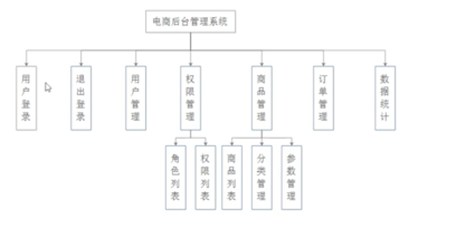

# Vue商城管理实战

### 项目前准备

#### 划分功能模块




### 项目开始

#### 新建一个项目

**使用vue-cli3**

`vue create 项目名`

**配置路径别名**

1. 新建vue.config.js

2. 写入配置信息

   ```js
   const path = require('path'); //引入path模块
   function resolve(dir) {
     return path.join(__dirname, dir); //path.join(__dirname)设置绝对路径
   }
   
   
   module.exports = {
   
     chainWebpack: (config) => {
       config.resolve.alias
         //set第一个参数：设置的别名，第二个参数：设置的路径
         .set('@', resolve('./src'))
         .set('components', resolve('./src/components'))
         .set('assets', resolve('./src/assets'))
         .set('views', resolve('./src/views'))
         .set('network', resolve('./src/network'));
       //注意 store 和 router 没必要配置
     }
   };
   ```

3. 启用别名配置后，vscode路径提示，[戳这里文章](https://www.jianshu.com/p/1798d57ecdab)

**引入`normalize.css`,**

在App.vue的style中使用`@import url("assets/css/base.css");`

**安装vue-router**

1. `npm install vue-router -s -d`

2. 新建router文件夹

   ```js
   import Vue from 'vue';
   import VueRouter from 'vue-router';
   
   const HellWorld = () => import('components/HelloWorld.vue');
   
   
   Vue.use(VueRouter);
   
   const routes = [{
     path: '',
     redirect: '/home'
   }, {
     path: "/home",
     component: HellWorld
   }];
   
   
   export default new VueRouter({
     routes
   });
   ```

3. 在main.js中引入

   ```js
   import router from './route/index';
   new Vue({
     router,
     render: h => h(App),
   }).$mount('#app');
   ```

**安装axios**

1. `npm install axios -s`

2. 封装api请求,

   新建network文件夹

   新建request.js

   ```js
   import axios from 'axios';
   
   export function request(config) {
     const instance = axios.create({
       baseUrl: '...',
       timeout: 5000
     });
   
     // 拦截发送请求
     instance.interceptors.request.use(config => {
       return config;
     }, err => {
       console.log('发送请求失败' + err);
     });
   
     // 拦截响应
     instance.interceptors.response.use(res => {
       return res.data;
     }, err => {
       console.log("响应失败" + err);
     });
   
     return instance(config);
   }
   ```

**引入elementUI**

1. 引入`vue add element`

   + How do you want to import Element? -->选择 `Import on demand` （关键）
   + Choose the locale you want to load–>选择 `zh-CN`

2. 使用

   1. 在plugins.js中引入需要的组件

   2.  在需要使用的地方使用`      <el-button>el-button</el-button>`

   